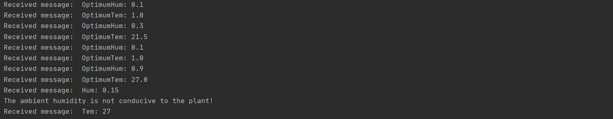
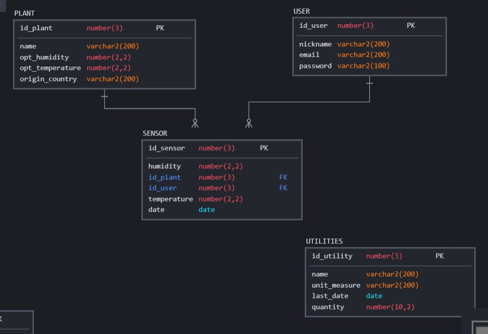

# Velvere

The API illustrates the "brain" of an intelligent greenhouse, able to take information from the environment and manipulate it according to the needs of the plant.

<h2> The main functionalities </h2>
<ul>
	<li>Authentification service</li>
	<li>Handling of information taken from sensors (humidity, temperature, fertilizer)</li>
</ul>

Source of inspiration: <a href="https://github.com/CryceTruly/bookmarker-api">here</a>

<h2> Communication protocols used </h2>
<ul>
	<li>Http</li>
	<li>Mqtt</li>
</ul>
<h2>Development</h2>

For the development I used the <a href="https://flask.palletsprojects.com/en/2.0.x/">Flask</a> framework and for the database, <a href="https://docs.sqlalchemy.org/en/14/">SQLAlchemy</a>.

<h2>Some photos from mqtt subscriber</h2>

For Mqtt I used a public broker: broker.hivemq.com

<h2>Schema Database</h2>
